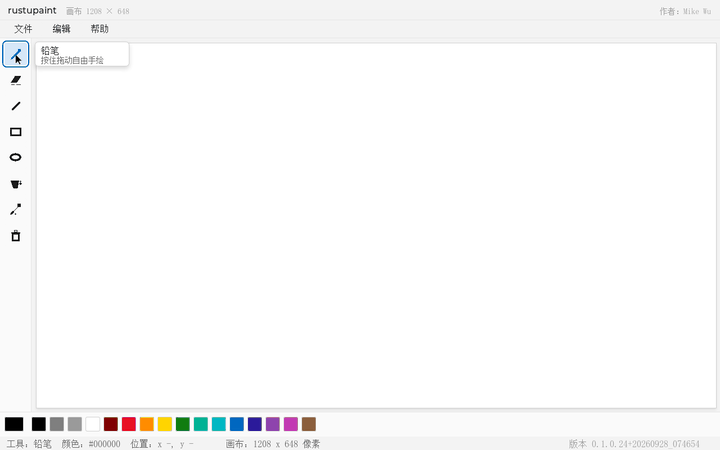
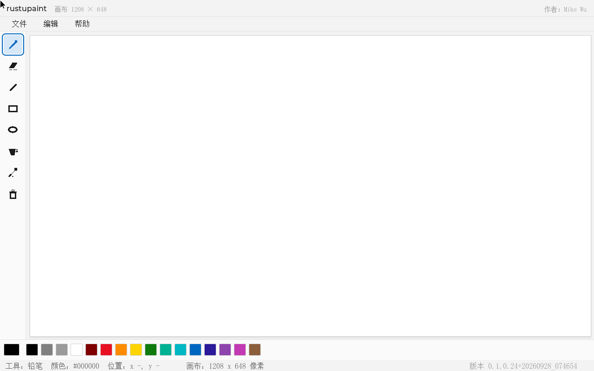

# rustupaint

**在 UEFI Shell 里运行的画图程序 —— 应用逻辑用 Rust 写，渲染交给 LVGL 9.2.2。**

> **[English](README.en.md) | 简体中文**


-blue)


操作系统还没起来的时候，屏幕上通常只有一行 `Shell>`。rustupaint 把这块黑底换成了一个
Windows 11 风格的画板：菜单栏、工具栏、调色板、状态栏，还有一个能用鼠标画画的画布。

它不是模拟器，是一个真正的 `.efi` —— 直接跑在固件上，读 GOP 帧缓冲，收 USB 鼠标事件。

---

## 一、先看效果

### 八个工具，鼠标悬停出提示

把指针停在左侧图标上约 0.4 秒，会浮出「工具名 + 一句用法」。LVGL 9 没有原生 hover 状态，
这是每拍轮询指针位置自己算命中做出来的。



### 完整操作演示

选色 → 铅笔 → 直线 → 矩形 → 椭圆 → 填充 → 取色 → 菜单 → 撤销 → 关于。
每一步都是 QEMU 实机截图，不是示意图。


### 界面总览



| 区域 | 说明 |
|---|---|
| 标题栏 | 应用名居中，右上角是作者署名 |
| 菜单栏 | 文件 / 编辑 / 帮助，Windows 11 风格下拉卡片 |
| 工具栏 | 8 个手绘图标，悬停出中文提示 |
| 画布 | 居中白色文档区，鼠标拖动即可绘制 |
| 调色板 | 单行 16 色，最左侧为当前色预览 |
| 状态栏 | 当前工具、颜色、光标坐标、画布尺寸、版本号 |

---

## 二、它能做什么

| 能力 | 现状 |
|---|---|
| 界面语言 | 全中文。需要 CJK 字库，标签走 `FONT_CJK` / `FONT_CJK_SMALL`；拉丁字库下会静默消失。`python tools/gen_cjk_font.py --check` 可校验覆盖率 |
| 绘制工具 | 铅笔、橡皮、直线、矩形、椭圆、油漆桶、吸管、清空 |
| 图标 | 8 枚 26×26 手绘图标，以光栅运算画在 ARGB8888 子画布上（`rust/src/icon.rs`），因此在正常 / 按下 / 聚焦三种状态下都正确 |
| 调色板 | 单行 16 色，实时预览，吸管可回取画布上任意颜色 |
| 撤销 | 8 层快照栈 |
| 键盘 | `Tab` / `Shift+Tab` 切换焦点 —— 聚焦控件有 2px 蓝色焦点环和高亮底，失焦保持扁平（Windows 11 的「点亮 / 压暗」观感）；`Enter` 激活，`Esc` 关闭菜单与对话框，方向键在弹层内导航 |
| 鼠标 | 点选工具与色块，在画布上拖动绘制；笔画做插值，快速拖动不会断线 |
| 菜单 | 文件（新建 / 退出）、编辑（撤销 / 清空）、帮助（关于） |
| 对话框 | Windows 11 风格模态卡片 + 遮罩，打开期间焦点组收敛到对话框内 |

**完整图文手册见 [`docs/manual/index.html`](docs/manual/index.html)** —— 12 章、29 张实机截图、2 个 GIF。

---

## 三、架构：EDK2 当链接器，Rust 当大脑

有意思的地方不在于"能在 UEFI 上画图"，而在于**它是怎么拼起来的**。

```
        Rust  (rust/src, 约 2500 行)
   app.rs      布局、事件分发、菜单、对话框、绘制交互、悬停提示
   canvas.rs   文档模型 + 光栅图元（铅笔/直线/矩形/椭圆/填充/撤销）
               —— 纯像素，不掺任何 UI 概念
   icon.rs     8 枚工具图标，画在 ARGB 子画布上
   theme.rs    Win11 色板、度量、工具中文名
   ffi.rs      全项目唯一出现 C 符号的地方
   widget.rs   基于 shim 的 Win11 风格控件原语
        |
        |  扁平 C ABI：颜色 0xRRGGBB，单个事件 trampoline
        v
        C   (RustPaintPkg/Application/RustPaint)
   UefiMain.c  入口：版本断言、port 生命周期、主循环节拍
   RpShim.c    把 LVGL 的类型与枚举翻译成稳定的 RP_* ABI
        |
        v
      LVGL 9.2.2  (LvglPkg: LvglLib + LvglUefiPort)
        |
        v
   GOP 帧缓冲 / SimpleTextIn 键盘 / USB 鼠标
```

Rust 由 cargo 编成**静态库**，**EDK2 是顶层链接器**：`RustPaint.inf` 把 `rp_core.lib`
作为**输入文件**交给链接行（`/LIBPATH:$(MODULE_DIR) rp_core.lib`）。这样既保留了工作区
既有约定（DSC/INF 包、LvglPkg 链接、串口版本断言通道），又让 cargo 构建完全不用碰 LVGL
和 EDK2 的头文件——**不需要 bindgen**。

两个细节是真正承重的，各自都花掉过一次调试：

- **`/DEFAULTLIB:` 在这里无效** —— EDK2 的链接命令以 `/NODEFAULTLIB` 开头，会忽略全部
  `/DEFAULTLIB:` 指令。库必须以输入文件的形式出现在命令行上。
- **库叫 `rp_core.lib`，不能叫 `rustupaint.lib`** —— EDK2 会用 `<BASE_NAME>.lib` 命名模块
  自身的对象归档，同名会解析到那个归档而不是我们的库
  （`rustupaint.lib(UefiMain.obj) : error LNK2001: unresolved rp_app_build`）。

### C ABI 边界上的三条规矩

`RpShim.h` 就是全部契约，它只立三条规矩：

1. **不得出现任何 LVGL 类型或枚举。** 只允许 `UINT32` / `UINT64` 标量；颜色以
   `0x00RRGGBB` 加一个独立的不透明度字节穿越边界。Rust 因此从不 include 任何 EDK2 头文件。
2. **Rust 不知道 `lv_obj_t`、`lv_color_t`、`LV_ALIGN_*`、`LV_EVENT_*` 是什么。**
   事件码、按键、对齐、字体、标志全部在 C 侧翻译成稳定的 `RP_*` 值。改一侧就必须同步改
   `rust/src/ffi.rs` 里的同名常量。
3. **只有一个事件 trampoline。** 对象携带一个打包的 `user` 值（高字节是类，低 24 位是索引），
   由单个 `extern "C"` 函数分发。整条 UI 事件路径**零动态分配** —— 没有闭包，没有
   `Box<dyn Fn>`，no_std 分配器没有可踩的坑。

---

## 四、目录结构

```
RustInUEFI/
├── rust/                    Rust 侧（cargo 产出 rp_core.lib）
│   ├── src/                 app / canvas / icon / theme / ffi / widget
│   └── Cargo.toml           crate-type = ["staticlib"]
├── RustPaintPkg/            EDK2 包：C shim + 应用入口
│   └── Application/RustPaint/
│       ├── RpShim.h/.c      C ABI 契约与实现
│       └── UefiMain.c       入口与主循环
├── LvglPkg/                 LVGL 9.2.2 + UEFI 移植层（**不随仓发布，需自备**）
├── tools/                   构建与验证脚本
│   ├── Build-RustPaint.ps1  完整构建（cargo → EDK2 → dist/ + qemu_disk/）
│   ├── Run-RustPaintQemu.ps1  启动 QEMU（交互 / 脚本化）
│   ├── qmp_drive.py         通过 QMP 注入指针与按键、抓帧
│   ├── check_stroke.py      落点像素校验（防坐标偏移回归）
│   ├── make_gif.py          截图串 GIF
│   └── gen_cjk_font.py      中文字库生成与覆盖率校验
├── docs/
│   ├── manual/index.html    产品手册（12 章、29 图、2 GIF）
│   └── 可行性调研.md        立项前的选型调研
├── CLAUDE.md                开发笔记：踩过的坑与纪律（强烈推荐一读）
└── req.md                   原始需求
```

---

## 五、快速开始

### 只想跑一下

从 [Releases](https://github.com/MikeWuPing/RustPaintUEFI/releases) 下载
`rustupaint.efi`（以及同包内的 `OVMF_CODE.fd`、`startup.nsh`）：

1. 把三个文件放进一个 FAT32 格式的 U 盘，U 盘根目录建 `EFI/BOOT/` 结构，或直接让
   UEFI Shell 从 U 盘启动并执行 `fs0:\rustupaint.efi`。
2. 虚拟机用户：见下一节的 QEMU 命令。

### 在 QEMU 里跑

```powershell
# 交互模式：有窗口、鼠标可用，直接上手玩
powershell -ExecutionPolicy Bypass -File tools/Run-RustPaintQemu.ps1 -Interactive

# 无头模式：启动、抓帧、注入指针与按键、断言版本
powershell -ExecutionPolicy Bypass -File tools/Run-RustPaintQemu.ps1 `
  -Script "t4 screendump main t1 hover|120|300 t1 btn|left t1 screendump drew"
```

鼠标点进窗口后会被 QEMU 捕获，按 **左 Ctrl + 左 Alt** 释放。

运行证据落在 `run_logs/`（串口 + QEMU stderr）与 `snapshot/`（PNG 帧）。一次运行只有
串口的 `APP_VERSION=` 行与 `expected_version.txt` **逐字节一致**才算成功 —— 这是防止
"拿旧版 .efi 冒充构建成功"的闸门。

### 从源码构建

前置条件：EDK2（VS2019 工具链）、QEMU、Rust 工具链（`rustup` + `x86_64-unknown-uefi` 目标），
以及 **LvglPkg**。

> **LvglPkg 不随本仓库发布。** 它的上游 `MikeWuPing/UEFI_Tools` 目前是私有仓库，既不能作为
> submodule 引用，也不能公开分发。构建前请把 `LvglPkg/` 放到仓库根目录（与 `RustPaintPkg`
> 同级），内容包含 `LvglLib`（LVGL 9.2.2 本体）与 `LvglUefiPort`（UEFI 移植层）——
> 或者用 [LVGL 官方 9.2.2 源码](https://github.com/lvgl/lvgl) 配合自己的移植层组装。
> 仓库里的 `.gitignore` 已把 `/LvglPkg/` 排除在外，所以本地放进去不会被误提交。
>
> 只想看效果的话不必管这些 —— 直接下载 Release 里的 `rustupaint.efi` 即可。

```powershell
rustup target add x86_64-unknown-uefi

# 完整构建：cargo 静态库 → EDK2 链接 → dist\ 与 qemu_disk\
powershell -ExecutionPolicy Bypass -File tools/Build-RustPaint.ps1 -Target RELEASE

# 还没有 Rust 工具链？用 C 桩验证除 Rust 之外的整条链路
powershell -ExecutionPolicy Bypass -File tools/Build-RustPaint.ps1 -StubRust
```

> Windows 注意：`%USERPROFILE%\.cargo\bin` 里的 rustup shim 在某些环境下会挂死
> （`rustc --version` 无输出且不返回）。构建脚本因此直连
> `%USERPROFILE%\.rustup\toolchains\stable-x86_64-pc-windows-msvc\bin\cargo.exe`。

---

## 六、边界与已知限制

| 项 | 说明 |
|---|---|
| 固件 | QEMU 启动时**不加** `-machine q35`、不加 vars pflash，让 OVMF 回落到内建的 UEFI Shell，由 `fs0:\startup.nsh` 拉起应用。鼠标需要 `-usb -device usb-mouse` |
| 分辨率 | 布局取自当前 GOP 分辨率（QEMU 实测 1280×800） |
| 撤销栈 | 固定 8 层整幅快照；层数越多内存占用越大 |
| 未实现 | 文件保存 / 打开（需要 UEFI Simple File System 与文本输入控件）；标题栏最小化 / 最大化 / 关闭按钮；油漆桶的大面积填充性能（当前是逐像素扫描线，QEMU 下大区域会卡） |
| Tab 键 | LVGL 的 UEFI 移植层把 `Tab` 映射成自定义键而非 `LV_KEY_NEXT`，所以焦点导航由应用自己驱动，不走 LVGL 的 group 机制 |

---

## 七、许可

本项目 MIT，见 [`LICENSE`](LICENSE)。

`LvglPkg/` **不在本仓库内**（见「从源码构建」一节）。它是独立依赖项，上游为私有仓库
`MikeWuPing/UEFI_Tools`；其中的 LVGL 本体遵循 LVGL 自身的 MIT 许可。

---

## 八、作者

**Mike Wu** · mikewuping@163.com · [GitHub](https://github.com/MikeWuPing)

署名同时出现在标题栏右上角与「关于」对话框中，两处读取 `app.rs` 里同一组
`AUTHOR_LINE` / `AUTHOR_MAIL` 常量。

---

<p align="center">
  <a href="README.en.md">English documentation</a>
</p>
